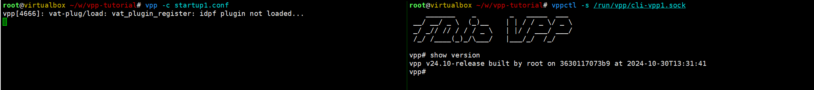

# vpp hello world

## 前言

本文使用包管理的方式安装vpp，并启动vpp。

## vpp 的安装

参考：[Setting up your environment — The Vector Packet Processor](https://s3-docs.fd.io/vpp/25.02/gettingstarted/progressivevpp/settingupenvironment.html)

```shell
# update os
sudo apt-get update
sudo apt-get dist-upgrade -y
sudo apt-get install curl

# Configure Apt Using the Packagecloud Setup Script

## vpp_24.10-release_amd64.deb
curl -s https://packagecloud.io/install/repositories/fdio/release/script.deb.sh | sudo bash

## vpp-dev_24.10-release_amd64.deb
curl -s https://packagecloud.io/install/repositories/fdio/release/script.deb.sh | sudo bash

sudo apt-get install vpp vpp-plugin-core vpp-plugin-dpdk
sudo apt-get install python3-vpp-api vpp-dbg vpp-dev

systemctl stop vpp
systemctl disable vpp
```

## vpp的启动

参考：[Running VPP — The Vector Packet Processor documentation](https://s3-docs.fd.io/vpp/25.02/gettingstarted/progressivevpp/runningvpp.html)

`vpp` 需要一个配置文件。配置文件的含义可以参考：[Configuration Reference — The Vector Packet Processor documentation](https://s3-docs.fd.io/vpp/25.02/configuration/reference.html#)

```conf
# 保存为 startup1.conf
unix {nodaemon cli-listen /run/vpp/cli-vpp1.sock}
api-segment { prefix vpp1 }
plugins { plugin dpdk_plugin.so { disable } }
```

使用这个配置启动 `vpp`。结果如下图所示。

```shell
root@virtualbox ~/w/vpp-tutorial# vpp -c startup1.conf
vpp[4666]: vat-plug/load: vat_plugin_register: idpf plugin not loaded. # 如何安装这个插件呢？先放一放

root@virtualbox ~/w/vpp-tutorial# vppctl -s /run/vpp/cli-vpp1.sock
vpp# show version
vpp v24.10-release built by root on 3630117073b9 at 2024-10-30T13:31:41
```



## vppctl 的简单使用 - 为vpp添加一个网卡

参考：[Creating an Interface — The Vector Packet Processor documentation](https://s3-docs.fd.io/vpp/25.02/gettingstarted/progressivevpp/interface.html)

在 `vppctl` 中可以通过 命令+? 的方式，查看该命令的使用。

在 host 上创建并启用一个 veth。

```shell
sudo ip link add name vpp1out type veth peer name vpp1host
sudo ip link set dev vpp1out up
sudo ip link set dev vpp1host up
sudo ip addr add 10.10.1.1/24 dev vpp1host
```

`vpp` 接管 vpp1host 。

```shell
vpp# create host-interface name vpp1out
host-vpp1out

vpp# show hardware
              Name                Idx   Link  Hardware
host-vpp1out                       1     up   host-vpp1out
  Link speed: unknown
  RX Queues:
    queue thread         mode      
    0     main (0)       interrupt 
  TX Queues:
    TX Hash: [name: hash-eth-l34 priority: 50 description: Hash ethernet L34 headers]
    queue shared thread(s)      
    0     no     0
  Ethernet address 02:fe:97:ce:d0:8b
  Linux PACKET socket interface v3
  FEATURES:
    qdisc-bpass-enabled
    cksum-gso-enabled
  RX Queue 0:
    block size:65536 nr:160  frame size:2048 nr:5120 next block:4
  TX Queue 0:
    block size:69206016 nr:1  frame size:67584 nr:1024 next frame:0
    available:1024 request:0 sending:0 wrong:0 total:1024
local0                             0    down  local0
  Link speed: unknown
  local

vpp# set int state host-vpp1out up

vpp# show interface
              Name               Idx    State  MTU (L3/IP4/IP6/MPLS)     Counter          Count     
host-vpp1out                      1      up          9000/0/0/0     rx packets                     5
                                                                    rx bytes                     350
                                                                    drops                          5
                                                                    ip6                            5
local0                            0     down          0/0/0/0       


vpp# set int ip address host-vpp1out 10.10.1.2/24

vpp# show interface address
host-vpp1out (up):
  L3 10.10.1.2/24
local0 (dn):

```

## 更多阅读

- [Progressive VPP Tutorial — The Vector Packet Processor v25.02-rc0-121-gaa488dd3f documentation](https://s3-docs.fd.io/vpp/25.02/gettingstarted/progressivevpp/index.html)